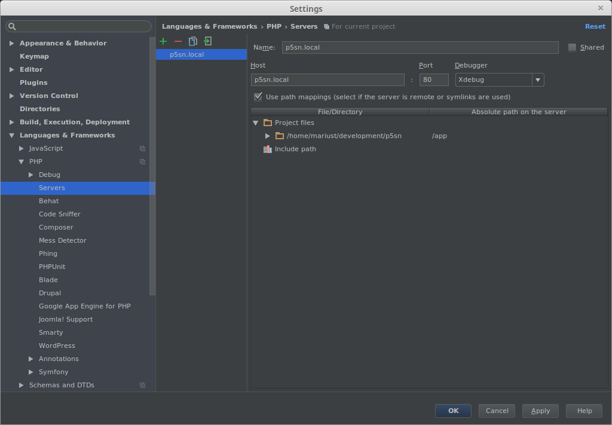

##Docker repository for p5sn

#### *!NOTE: Was tested on:*
   * *Docker version 1.11.2, build b9f10c9*
   * *docker-compose version 1.6.2, build 4d72027*

####Preparation for use:
1. To use this you need to [install](https://docs.docker.com/engine/installation/) locally docker.
2. Also [install](https://docs.docker.com/compose/install/) docker compose.

### Making to work!

#### Building containers and downloading/making needed images:
1. Execute from terminal: `cd /path/to/your/cloned/docker_p5sn`
2. Copy file `docker-compose.yml.dist` in `docker-compose.yml`
3. Edit in key 'volumes' and put your `/path/to/project/`
4. Execute from terminal: `docker-compose up -d` #"-d" option to run in detached mode.

#### Importing database:
1. Copy db dump to: `/path/to/your/cloned/docker_p5sn/mysql`
2. Rename dump to: `p5sndb.sql`
3. Execute from terminal: `./enter-container.sh root p5sn_db` #You are entering in container "p5sn_db" with user "root"
4. From container execute in terminal: `cd /database/import_db`
5. Execute from terminal: `chmod +x import_db.sh`
6. Import db by executing from terminal: `./import_db.sh`

#### Entering p5sn container:
1. Execute from terminal: `cd /path/to/your/cloned/docker_p5sn`
2. Execute from terminal: `chmod +x enter-container.sh` #if needed
3. Execute from terminal: `./enter-container.sh`, now you are in p5sn container, by default is "p5sn" container with 
    user "root"
4. Execute from terminal: `cd app`, now you are in the symfony project, from here you clean cache, make composer install, 
    but not commit with git, to commit with git you need to make this from outside of container due to docker root file 
    permission that will change permissions
5. Give [permissions](http://symfony.com/doc/2.3/book/installation.html) to `cache/, logs` maps
6. Run: `composer install`
7. Execute from terminal on your local machine: `sudo nano /etc/hosts`
8. Add there and save: `127.0.0.3    p5sn.local`
8. Have fun!

### Configuring xdebug in PhpStorm

#### *!NOTE: This configuration is for those where don't work `PHP_IDE_CONFIG` environment.*

1.

2.

